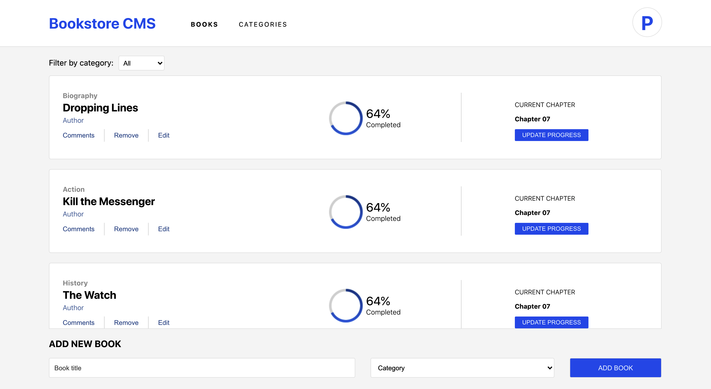

# Bookstore Manager

> This is a bookstore management application built with ReactJS and Redux.

## Built With

- ReactJS,
- Redux,
- Jest
- Enzyme

## Live Demo

[Live Demo Link](https://dry-garden-92123.herokuapp.com/)

## Getting Started

To get a local copy up and running in development mode, follow these simple steps.

### Prerequisites

- Node.js
- Browser
- Terminal

### Setup

Clone the project from [here](https://github.com/pbkabali/Bookstore)

### Install

Run `npm install` to get all the dependencies.

Run `npm start` to start the web-server.

### Usage

Go to `https://localhost:3000` in your browser.

## Author

👤 **Paul Balitema Kabali**

- Github: [@pbkabali](https://github.com/pbkabali)
- Twitter: [@pbkabali](https://twitter.com/pbkabali)
- Linkedin: [engineerbpk](https://linkedin.com/in/engineerbpk)

## 🤝 Contributing

Contributions, issues and feature requests are welcome!

Feel free to check the [issues page](https://github.com/pbkabali/Bookstore/issues).

## Show your support

Give a ⭐️ if you like this project!

## Acknowledgments

- Microverse Team 140 (The Cupids)
- [Zeplin](app.zeplin.i)

## 📝 License

This project is [MIT](https://opensource.org/licenses/MIT) licensed.
